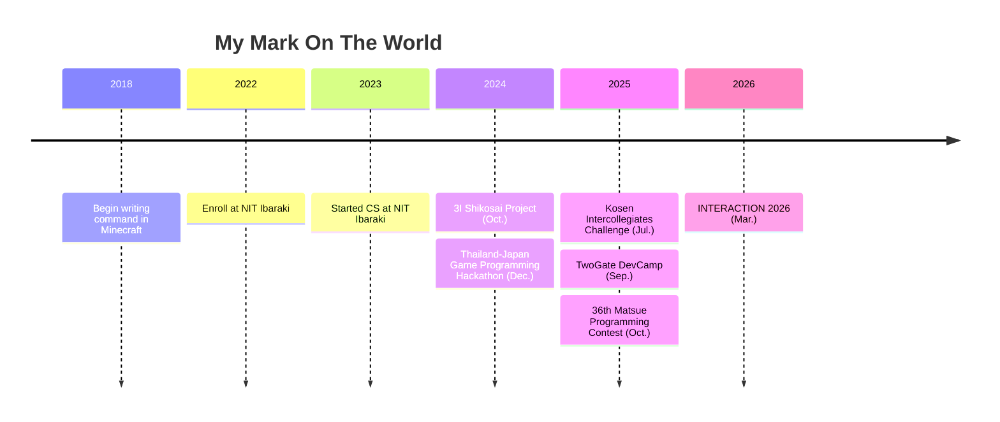

# Code Enthusiast

  

---

## Current Focus

<table align="center" width="100%">
  <tr>
    <td valign="top" width="33%">

### 📦 On Hold

</td>
<td valign="top" width="33%">

### 🚧 In Progress
- [BlackBoardCleaner](https://github.com/Tomarun029831/BlackBoardCleaner)

</td>
<td valign="top" width="33%">

### 🛠️ Periodic Updates
- [RoamBird](https://play.unity.com/en/games/dae4eae7-04fb-46ca-8ecd-b6d405c7df6b/roambird)

</td>
  </tr>
</table>

---
## Development Environment

<table align="center">
<tr>
<td width="25%">

### Systems

</td>
<td width="25%">

### Shells

### Emulators

</td>
<td width="25%">

### Editors

</td>
<td width="25%">

### Dotfiles

</td>
</tr>
</table>

---

Experience by Application Category

C#/Unity
- AR  
- 2D Action Game  
- 3D Tower Defense Game  

TypeScript & GAS
- GAS API for Spreadsheet (as database for account data, game progression data)

Python  
- Automation Tools

C/C++ on Arduino CLI  
- Automation *Tiny* Robot (with ESP32)

C  
- CLI Game
- parser

Built Real Applications With

Learning / Prototyping Only

---

Books Conquered

### **🎮 Game Development**
- 『ゲームで学ぶJavaScript入門 増補改訂版～ブラウザゲームづくりでHTML＆CSSも身につく！』
- 『Pythonでつくる ゲーム開発 入門講座』
- 『Pythonでつくる ゲーム開発 入門講座 実践編』
- 『Pythonで作って学べる ゲームのアルゴリズム入門』

### **💻 Programming Languages**
- 『確かな力が身につくJavaScript「超」入門 第2版』
- 『1週間でC++の基礎が学べる本 (1週間プログラミング)』
- 『確かな力が身につく C#「超」入門 第3版 (Informatics & IDEA)』
- 『スッキリわかるJava入門』

### **🏗️ Software Engineering**
- 『リーダブルコード』
- 『良いコード／悪いコードで学ぶ設計入門―保守しやすい 成長し続けるコードの書き方』
- 『Java言語で学ぶデザインパターン入門』
- 『達人プログラマー』
- 『テスト駆動開発』
- 『Javaによる関数型プログラミング ―Java 8ラムダ式とStream』

### **🌐 Infrastructure & Database**
- 『図解AWS (Amazon Web Services) の仕組みとサービスがたった1日でよくわかる』
- 『SQL : ゼロからはじめるデータベース操作』
- 『ネットワークはなぜつながるのか』

### **🔧 System Administration**
- 『［試して理解］Linuxのしくみ　―実験と図解で学ぶOS、仮想マシン、コンテナの基礎知識』

Reading Backlog

### **🏗️ Advanced Software Engineering**
- 『オブジェクト指向における再利用のためのデザインパターン』
- 『Spring徹底入門 : Spring FrameworkによるJavaアプリケーション開発』
- 『Effective Java』
- 『Clean Code アジャイルソフトウェア達人の技』
- 『Clean Architecture 達人に学ぶソフトウェアの構造と設計』
- 『Good Code, Bad Code ～持続可能な開発のためのソフトウェアエンジニア的思考』
- 『［Web開発者のための］大規模サービス技術入門 - データ構造、メモリ、OS、DB、サーバ/インフラ』
- 『知識地図シリーズ』
- 『達人が教える Webパフォーマンスチューニング』
- 『失敗から学ぶ RDBの正しい歩き方』
- 『AWSで実現するモダンアプリケーション入門』
- 『Webエンジニアのためのデータベース技術「実践」入門』
- 『MySQL 運用・管理 [実践]入門』
- 『SREをはじめよう』
- 『SLO サービスレベル目標』
- 『詳解 Terraform』
- 『Kubernetesの知識地図』
- 『基礎から学ぶコンテナセキュリティ』
- 『入門 監視』
- 『ソフトウェアアーキテクチャの基礎』
- 『コンピュータネットワーク第6版』
- 『AWS 運用入門』
- 『マスタリングAPIアーキテクチャ』
- 『SQLアンチパターン』
- 『世界一流エンジニアの思考法』
- 『オブジェクト指向でなぜ作るのか』
- 『A Philosophy of Software Design, 2nd Edition』
- 『MAKE: Bootstrapper's Handbook』
- 『システム設計の面接試験』
- 『良い戦略、悪い戦略』
- 『ハッカーと画家 コンピュータ時代の創造者たち』
- 『100日チャレンジ 毎日連続100本アプリを作ったら人生が変わった』

### **💾 Computer Science Fundamentals**
- 『問題解決力を鍛える!アルゴリズムとデータ構造』
- 『コンピュータシステムの理論と実装』 <-- Current Reading Target
- 『コンピュータの構成と設計 MIPS Edition 第6版 上・下』
- 『ゼロからのOS自作入門』
- 『オペレーティングシステムの仕組み』

### **🌐 Network & Web Development**
- 『マスタリングTCP/IP―入門編―』
- 『体系的に学ぶ 安全なWebアプリケーションの作り方』
- 『Web API: The Good Parts』
- 『Webを支える技術 -HTTP、URI、HTML、そしてREST』
- 『［作って学ぶ］ブラウザのしくみ──HTTP、HTML、CSS、JavaScriptの裏側』
- 『暗号技術のすべて』

### **🗄️ Database & Data**
- 『達人に学ぶSQL徹底指南書 第2版 初級者で終わりたくないあなたへ』
- 『達人に学ぶDB設計徹底指南書 第2版』
- 『データ指向アプリケーションデザイン ―信頼性、拡張性、保守性の高い分散システム設計の原理』

### **☁️ Cloud & DevOps**
- 『Amazon Web Services』
- 『Docker実践ガイド』
- 『Kubernetes完全ガイド』

### **🧠 Machine Learning**
- 『ゼロから作るDeep Learning』

### **🦀 Modern Languages**
- 『実践Rustプログラミング入門』
- 『Kotlin サーバーサイドプログラミング実践開発』

### **💼 Career & Personal Development**
- 『世界で闘うプログラミング力を鍛える本 ~コーディング面接189問とその解法~』
- 『情熱プログラマー ソフトウェア開発者の幸せな生き方』
- 『冒険の書　AI時代のアンラーニング』

### **🎯 Life Skills**
- 『チェス上達の手引き　第2版』
- 『マンガでわかる最強の株入門 : めざせ「億り人」!』
- 『ニューヨーク流たった5人の「大きな会社」 : 我々の仕事の仕方・考え方』
- 『影響力の武器［新版］：人を動かす七つの原理』
- 『できる人の勉強法 : コミック版』
- 『人は話し方が9割 : 1分で人を動かし、100%好かれる話し方のコツ』
- 『まんがでわかるD・カーネギーの「人を動かす」「道は開ける」』シリーズ (1-3)
- 『ファシリテーション入門』
- 『なぜ僕らは働くのか-君が幸せになるために考えてほしい大切なこと』

---

Throwback

```mermaid
timeline
    title My Mark On The World

    2018 : Begin writing command in Minecraft

    2022 : Enroll at NIT Ibaraki
    
    2023 : Started CS at NIT Ibaraki
    
    2024 : 3I Shikosai Project (Oct.)
         : Thailand-Japan Game Programming Hackathon (Dec.)
    
    2025 : Kosen Intercollegiates Challenge (Jul.)
         : TwoGate DevCamp (Sep.)
         : 36th Matsue Programming Contest (Oct.)

    2026 : INTERACTION 2026 (Mar.)
```

GitHub Statistics

  

---

Certifications

- 技術英検二級 Certified
- TOEIC L&R 815 (2026/1/11)

Achievements

- 1st Runner-up - Thailand-Japan Game Programming Hackathon 2024  
  [EarthDefense](https://play.unity.com/en/games/f29d60f8-c03a-43ed-9983-1281f630518e/earth-defense) - Co-developed with [k4nk1](https://github.com/k4nk1) and team
- 優秀賞 - Kosen Intercolleage Challenge 6th  
- 参加賞 - Twogate DevCamp 2025  
- 敢闘賞 - 36th Matsue Programming Contest (Oct)  

---

"Perfection is achieved, 
not when there is nothing more to add, 
but when there is nothing left to take away." 
– Antoine de Saint-Exupéry 

